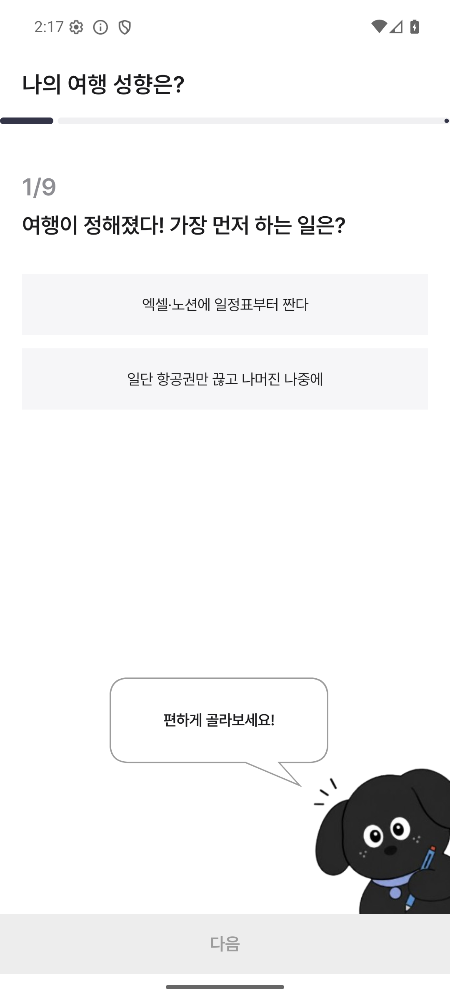
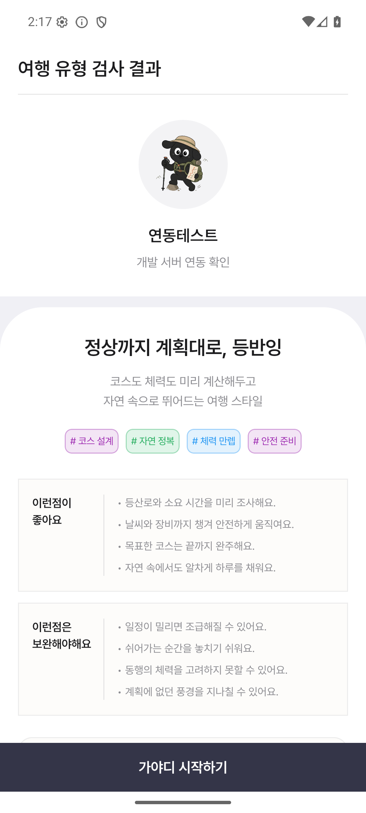
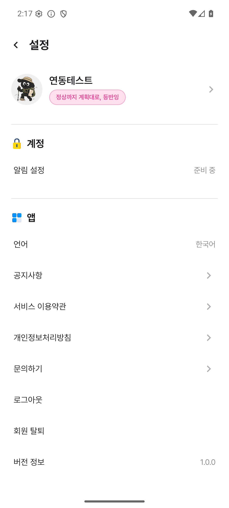
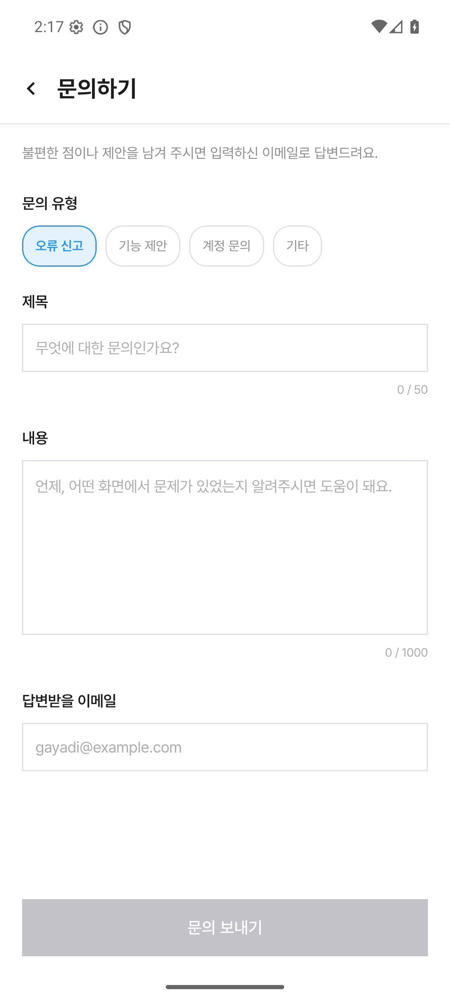
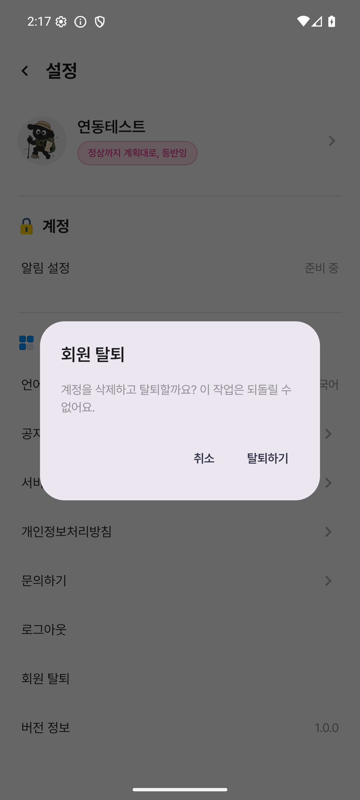
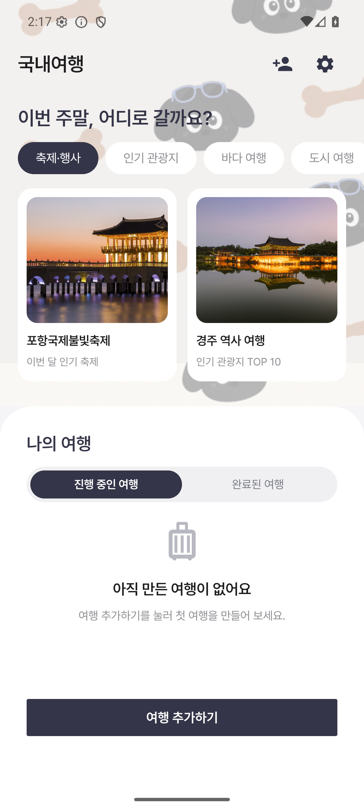
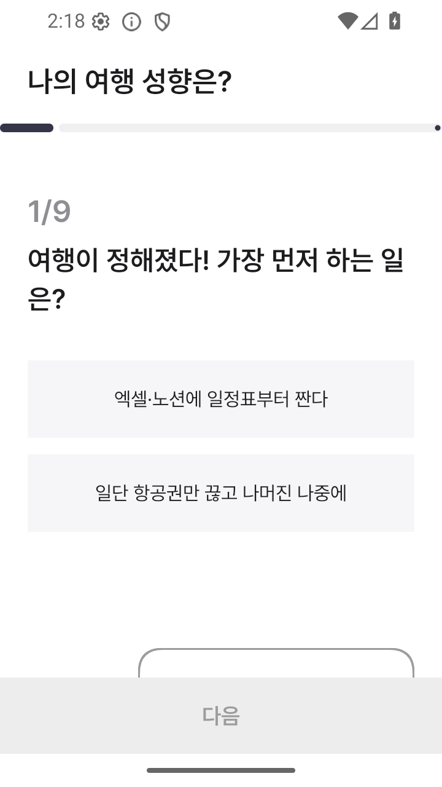
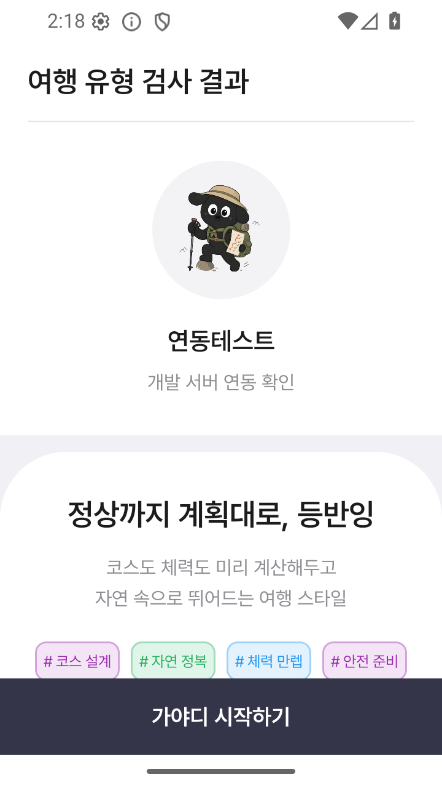

# 설문·문의·계정 REST API 연동

관련 이슈: #118, 상위 통합 작업: #101.

## 동작

`AppContainer`는 설문과 문의에 Firestore 대신 REST 구현을 주입합니다. 설문에서 사용자가 고른 성향 코드(P/S 등)는 문항의 실제 선택지 ID(a/b)로 변환해 서버에 제출합니다. 서버 저장·채점이 완료되어야 결과 화면으로 이동하고, 실패하면 답변을 유지하며 재시도할 수 있습니다. 제출 중에는 중복 요청을 막습니다. 작은 화면에서도 다음 버튼이 가려지지 않도록 문항 영역은 스크롤되고 하단 버튼은 고정됩니다. 다음 문항으로 이동하면 스크롤 위치를 처음으로 되돌립니다.

프로필은 로그인 세션이 있을 때 서버에서 읽습니다. 앱 시작 시 저장된 세션과 서버 프로필을 확인해 로그인·설문·여행 화면으로 이동하며, Google 로그인 직후에도 새 계정의 프로필을 조회합니다. 로컬 프로필만으로 인증된 화면에 진입하지 않습니다. 아직 서버 인증 흐름이 없는 카카오 버튼은 준비 중 안내를 표시합니다.

설정 화면에서 문의하기·로그아웃·회원 탈퇴에 접근할 수 있습니다. 로그아웃은 Swagger 계약에 맞춰 DELETE 본문에 refreshToken을 보내 서버 세션을 폐기한 후 암호화 세션과 기기 데이터를 정리합니다. 회원 탈퇴는 확인 대화상자를 거쳐 서버 삭제가 성공한 뒤 기기 데이터를 정리합니다. 서버 실패 시 세션과 로컬 프로필을 지우지 않습니다.

| 기능 | API |
| --- | --- |
| 설문 정의 | `GET /api/v1/surveys/travel-personality-v1` |
| 결과 정의 | `GET /api/v1/surveys/travel-personality-v1/results/{resultCode}` |
| 답변 저장·채점 | `POST /api/v1/surveys/travel-personality-v1/submissions` |
| 문의 등록 | `POST /api/v1/inquiries` |
| 프로필 조회·수정 | `GET`, `PATCH /api/v1/users/current` |
| 회원 탈퇴 | `DELETE /api/v1/users/current` |
| 로그아웃 | `DELETE /api/v1/auth/sessions/current` |

공통 HTTP 클라이언트는 인증이 필요한 요청에만 Bearer 토큰을 보냅니다. 401이면 토큰을 갱신해 한 번만 재시도합니다. 그 외 실패 및 재차 발생한 401은 호출자에게 전달합니다. 네트워크 오류에 대한 자동 쓰기 재시도와 리다이렉트는 사용하지 않으며, 코루틴 취소 시 HTTP 호출도 취소합니다.

## dev 빌드

```sh
cp config/dev.properties.example config/dev.properties
# Google/Kakao 설정값은 config/dev.properties에서 채웁니다.
./gradlew clean :app:assembleDevDebug
```

예제의 dev API 주소는 `http://223.130.134.57:8080`입니다. API 경로가 코드에 포함되므로 주소 뒤에 `/api`를 붙이지 않습니다. dev 빌드를 구성하는 데 prod 설정은 필요하지 않습니다. 해당 flavor의 BuildConfig 생성 단계에서는 실제 설정 파일 존재 여부를 검사하므로 prod 파일 없이 prod APK를 빌드할 수는 없습니다.

예제의 OAuth/지도 키는 placeholder입니다. 예제만 복사해 빌드한 APK로 Google 계정 선택·토큰 교환 또는 Kakao 지도를 검증했다고 볼 수 없습니다. 실제 설정 파일과 인증값은 Git에 포함하지 않습니다.

## 자동 검증

```sh
./gradlew :domain:test testDebugUnitTest :app:testDevDebugUnitTest lintDebug :app:lintDevDebug
./gradlew :app:assembleDevDebug :app:assembleDevDebugAndroidTest
```

`RestAccountSurveyApiTest`는 MockWebServer로 인증 헤더, 401 갱신·재시도 제한, 공개 설문 매핑, 선택지 ID 제출, 문의 등록 오류, nullable 프로필, 로그아웃의 refreshToken 본문, 탈퇴 성공·실패 시 로컬 상태를 검증합니다. `SurveySubmissionViewModelTest`는 서버 응답 전 화면 전환 방지, 중복 제출 방지, 실패 후 답변 보존과 재시도를 검증합니다.

`DevSurveyIntegrationTest`는 기본적으로 건너뜁니다. 별도 테스트용 에뮬레이터에서 `liveApi=true`를 명시해야 실제 dev 서버에 임시 계정을 만들며, 테스트 종료 시 해당 계정을 삭제합니다. 저장된 사용자 세션이 있거나 prod 주소인 경우 실행하지 않습니다. Google 인증 화면 대신 테스트에서 발급한 서버 세션을 암호화 저장소에 준비하므로 Google OAuth E2E 검증을 대신하지 않습니다.

```sh
adb install -r app/build/outputs/apk/dev/debug/app-dev-debug.apk
adb install -r app/build/outputs/apk/androidTest/dev/debug/app-dev-debug-androidTest.apk
adb shell pm grant com.doonow.gayadi android.permission.POST_NOTIFICATIONS
adb shell am instrument -w -e liveApi true \
  -e class com.gayadi.android.api.DevSurveyIntegrationTest \
  com.doonow.gayadi.test/androidx.test.runner.AndroidJUnitRunner
```

실제 문의를 서버에 전송하는 테스트는 하지 않습니다. 문의 POST는 MockWebServer로 검증합니다.

## 남은 통합 범위

여행·일정·경비의 로컬 저장소와 초대·날짜 조율의 Firestore 구현은 이번 변경에서 서버 저장소로 전환하지 않았습니다. 서버 ID·버전과 현재 화면의 UUID·상태 저장 흐름을 함께 바꾸는 별도 통합 작업이 필요합니다. 기존 로컬 여행 데이터를 서버에 자동 업로드하지 않습니다.

## 2026-09-09 검증 결과

- `clean` 후 dev APK, 전체 dev 단위 테스트와 Lint 통과. 최종 단위 테스트 보고서는 179건, 실패 0건입니다.
- 실서버 임시 계정으로 프로필 조회·수정(200), 설문 제출(201), 서버 프로필의 결과 반영(200), refreshToken 기반 로그아웃(204), 재로그인(200), 회원 삭제(204)를 확인했습니다. 생성한 테스트 계정은 삭제했습니다.
- API 36 에뮬레이터의 1080×2400/420dpi와 720×1280/360dpi에서 실서버 설문 9문항 제출, 결과 확인, 여행 목록 이동, 설정·문의·탈퇴 확인창 진입을 검증했습니다. 문의 전송과 탈퇴 확인창의 최종 확인 클릭은 화면 테스트에서 수행하지 않았습니다.
- 작은 화면에서 기존 고정 높이 캐릭터 영역이 다음 버튼을 가리던 문제를 수정하고 두 화면 크기에서 재검증했습니다.
- 첫 에뮬레이터 부팅 중 System UI ANR은 닫고 시스템이 안정된 뒤 테스트했습니다. 최종 실서버 화면 테스트는 정상 종료됐습니다.

| 서버 설문 | 서버 저장 후 결과 |
| --- | --- |
|  |  |

| 계정 메뉴 | 문의 화면 |
| --- | --- |
|  |  |

| 탈퇴 확인 | 설문 완료 후 여행 목록 |
| --- | --- |
|  |  |

| 작은 화면의 고정 하단 버튼 | 작은 화면의 결과 |
| --- | --- |
|  |  |
