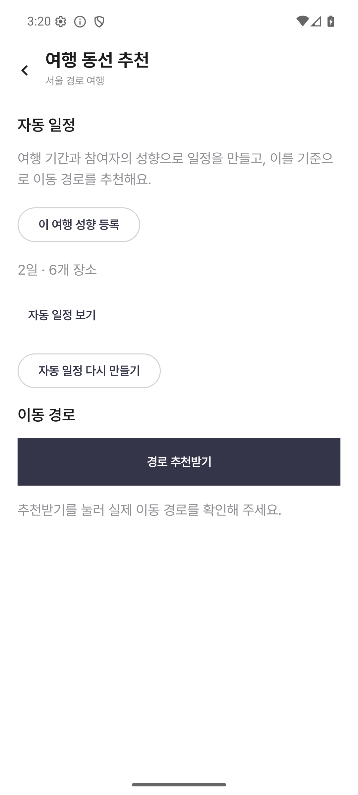
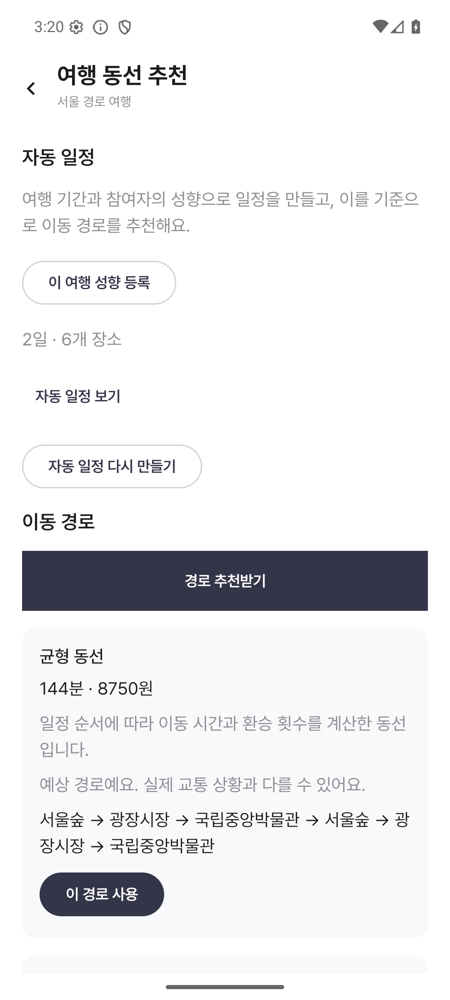
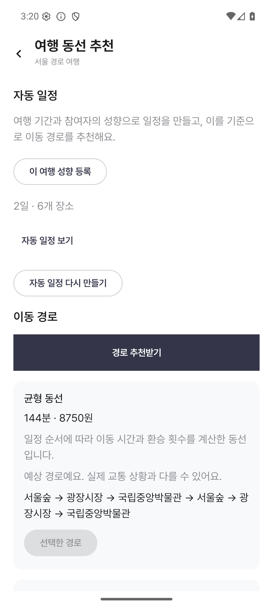
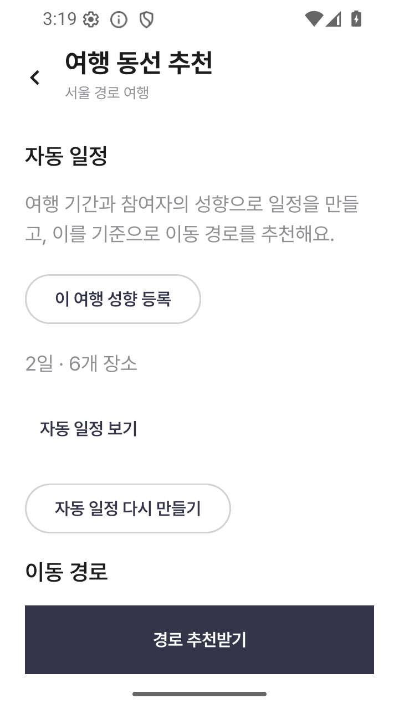
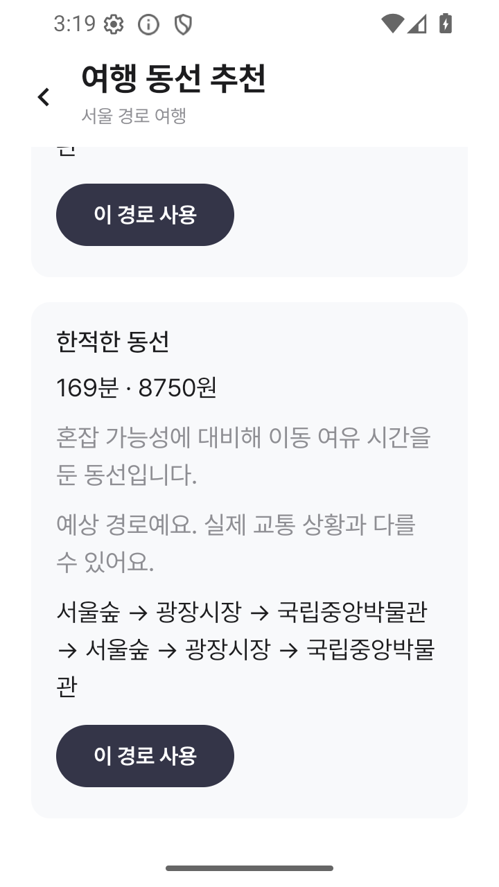
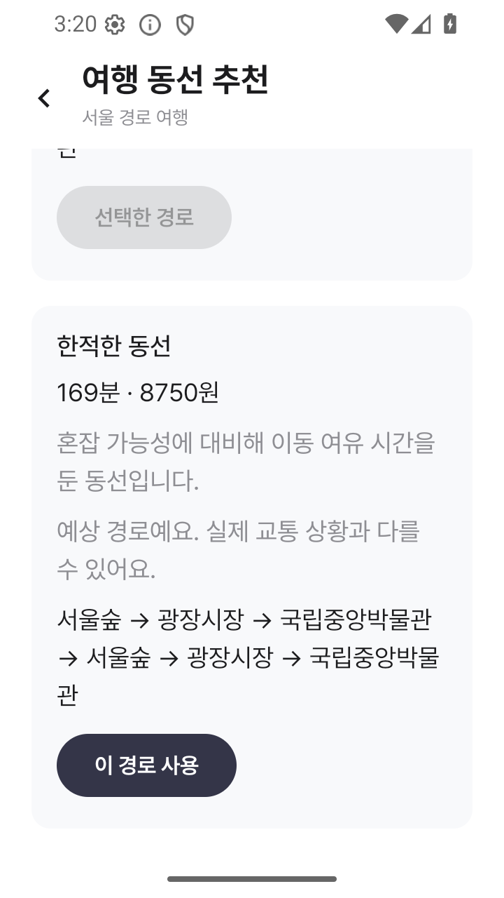

# 자동 일정과 추천 경로

## 연결한 API

| 동작 | API |
| --- | --- |
| 여행 성향 제출 | POST `/api/v1/trips/{tripId}/survey-responses` |
| 자동 일정 조회/생성 | GET/POST `/api/v1/trips/{tripId}/plans` |
| 경로 추천 | POST `/api/v1/trips/{tripId}/route-recommendations` |
| 선택 경로 조회 | GET `/api/v1/trips/{tripId}/route-selections` |
| 선택/해제 | PUT/DELETE `/api/v1/trips/{tripId}/route-selections/{type}` |
| 장소 검색 | GET `/api/v1/places?query=...&limit=20` |
| 본인 출발/귀가 장소 변경 | PUT `/api/v1/trips/{tripId}/participants/current/settings` |

경로 화면은 서버 데이터를 사용합니다. 화면 진입 시에는 조회만 하고, 추천·생성·선택은 버튼으로 실행합니다. 실패 시 이전 데이터를 유지하고 중복 요청을 막습니다. 자동 일정 재생성은 확인창을 거칩니다. 여러 날짜를 표시하며 경로의 제공되지 않은 거리·요금은 0으로 표시하지 않습니다. LOCAL_ESTIMATE/fallback은 예상 경로임을 안내합니다. 경유지 이름은 서버 Location의 label을 사용합니다.

프로필 설문과 여행 설문은 별개입니다. 자동 일정 생성에는 여행별 성향이 필요하므로 기존 9문항 설문 UI를 재사용해 해당 여행으로 제출합니다. 개인 경로는 로그인한 본인의 userId만 사용하고, 장소 변경 시 다른 출발/귀가 값은 유지합니다.

## 서버 의존성

[Server PR #50](https://github.com/TEAM-DOONOW/Gayadi-Server/pull/50)의 새 설정 API를 dev에 배포해야 개인 출발/귀가 장소 변경이 동작합니다. 기존 참여자 추가 API는 이미 가입한 사용자를 수정하지 못합니다. 아직 배포되지 않은 서버에서는 준비 중 안내를 표시합니다.

자동 일정과 ITINERARY 경로는 현재 dev에서 검증했습니다. 개인 장소 변경 및 DEPARTURE/HOME 실서버 검증은 서버 배포 후 진행해야 합니다. 앱 코드·매핑 테스트와 서버 157개 테스트는 통과했으며 서버 배포는 수행하지 않았습니다.

## 검증

- Android JVM 테스트 200개, 실패/오류 0.
- 전체 lint 및 dev 앱/테스트 APK 빌드 성공.
- opt-in `DevPlanningIntegrationTest`: 임시 계정/여행 생성 → 여행 성향 → 2일 자동 일정 생성/조회 → 동선 추천/선택/해제 → 실제 화면에서 여행 성향 제출/추천/선택 검증. 여행 삭제 후 계정 삭제.
- API 36 에뮬레이터 1080×2400 및 720×1280 검증. 스크린샷: `docs/screenshots/issue-121/`.

```sh
adb shell am instrument -w -e liveApi true \
  -e class com.gayadi.android.api.DevPlanningIntegrationTest \
  com.doonow.gayadi.test/androidx.test.runner.AndroidJUnitRunner
```

개인 경로까지 실행하려면 위 명령에 `-e participantSettings true`를 추가합니다. dev 빌드 및 로그아웃된 전용 에뮬레이터에서만 실행합니다. 토큰/계정 비밀번호는 출력하지 않습니다.

## 화면

| 자동 일정 | 추천 | 선택 |
| --- | --- | --- |
|  |  |  |
|  |  |  |
