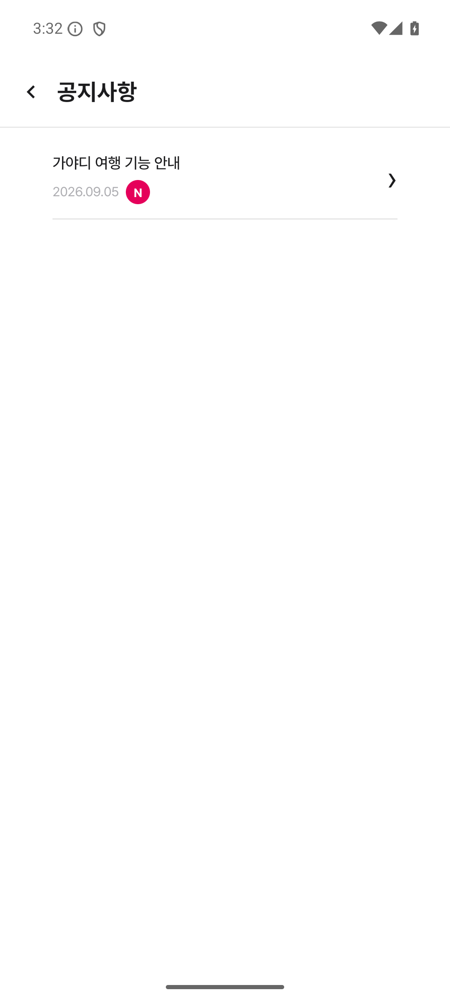
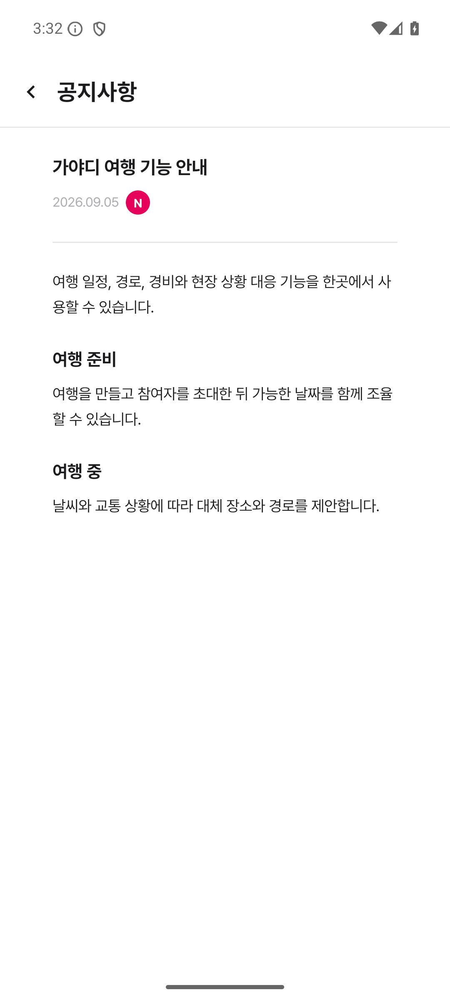
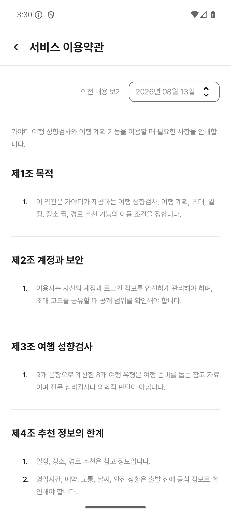
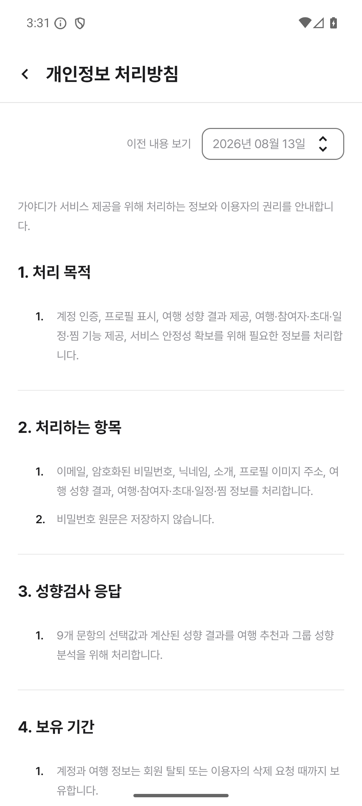
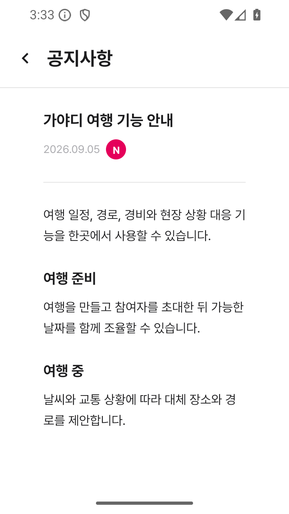

# 공지·법률 문서 REST 연동

설정의 공지 목록·상세와 이용약관·개인정보처리방침은 `RestPublicContentDataSource`를 통해 Gayadi 서버에서 조회합니다. `AppContainer`가 기존 관광 API와 같은 `API_BASE_URL`을 전달합니다. 별도 인증 토큰이나 새로운 환경변수는 필요하지 않습니다.

| 화면 | API |
| --- | --- |
| 공지 목록 | `GET /api/v1/notices?limit=100&offset=0` |
| 공지 상세 | `GET /api/v1/notices/{noticeId}` |
| 이용약관 | `GET /api/v1/legal-documents/terms-of-service` |
| 개인정보처리방침 | `GET /api/v1/legal-documents/privacy-policy` |

공지 목록은 100건씩 offset을 증가시켜 마지막 페이지까지 읽습니다. 중간 페이지에서 실패하면 부분 목록을 성공으로 표시하지 않습니다. 서버의 `isPinned`, 게시 시각, 본문 순서와 nullable 필드를 그대로 DTO로 매핑합니다.

Retrofit + Moshi로 비동기 요청을 처리하며 연결 10초, 읽기 20초, 전체 호출 30초 제한을 적용합니다. HTTP 실패·빈 응답·잘못된 JSON은 기존 화면의 오류/재시도 흐름으로 전달하고, 서버 오류 본문이나 파서 진단을 화면에 노출하지 않습니다. Firestore로 자동 우회하지 않습니다.

## 검증

`PublicContentApiTest`는 MockWebServer로 실제 HTTP 요청 경로, 페이지네이션, 두 법률 문서 응답, nullable 필드, 404/429/503, 204, 잘못된 JSON과 잘못된 식별자를 검증합니다.

```sh
./gradlew --no-daemon testDebugUnitTest lintDebug assembleDebug
```

배포 환경에서는 서버에 공개 상태의 공지와 두 법률 문서가 존재해야 합니다. 실기기 검증은 별도 항목입니다.

관련 이슈: #115, 상위 통합 작업 #101. OAuth 로그인 #112는 별도 작업입니다.

## 개발 서버 확인 (2026-09-07)

개발 서버의 8080 포트에서 아래 요청 모두 HTTP 200을 확인했습니다.

| 요청 | 결과 |
| --- | --- |
| 공지 목록 (`limit=100&offset=0`) | 가야디 여행 기능 안내 |
| 공지 상세 (`welcome-2026`) | 가야디 여행 기능 안내 |
| 이용약관 (`terms-of-service`) | 가야디 이용약관 |
| 개인정보처리방침 (`privacy-policy`) | 가야디 개인정보처리방침 |

API 36 에뮬레이터에서 공지 목록·상세, 이용약관, 개인정보처리방침의 실제 서버 데이터 표시와 화면 캡처를 완료했습니다. 공지 날짜에 시각 문자열이 그대로 붙던 문제는 표시 계층에서 날짜 부분만 사용하도록 수정했습니다. 원본 DTO 및 도메인 게시 시각은 보존됩니다.

초기 부팅 중 System UI 및 기본 전화 앱의 ANR이 기록됐습니다. 스냅샷을 사용하지 않고 소프트웨어 렌더링(`-no-snapshot -no-window -gpu swiftshader_indirect`)으로 실행한 뒤 시스템 시작이 안정된 상태에서 화면 이동과 캡처를 확인했습니다. 앱 프로세스의 AndroidRuntime 오류는 확인되지 않았습니다.

검증 APK의 기본 주소 `10.0.2.2:8080`은 로컬 TCP 전달기를 통해 실제 개발 서버의 8080 포트에 연결했습니다. 응답을 생성하거나 변경하는 mock 서버는 사용하지 않았습니다. 비밀 설정 파일도 변경하지 않았습니다.

| 공지 목록 | 공지 상세 |
| --- | --- |
|  |  |

| 이용약관 | 개인정보처리방침 |
| --- | --- |
|  |  |

일반 화면(1080×2400, 420dpi)과 작은 화면(720×1280, 360dpi)에서 공지 표시도 확인했습니다.



