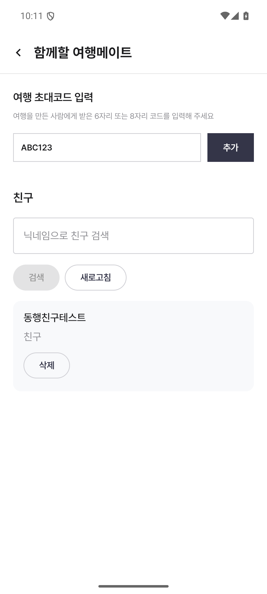
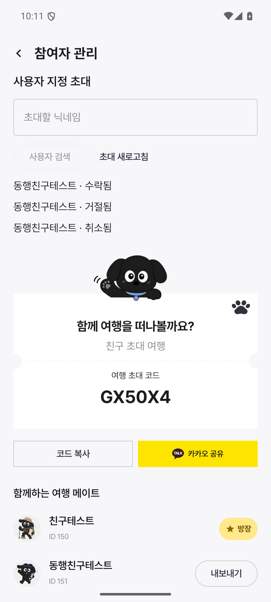
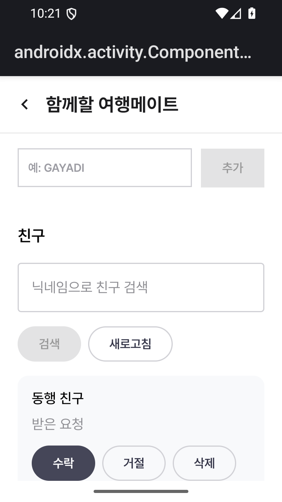

# 친구와 사용자 지정 여행 초대

기존 dev 서버 API만 사용하며 서버 변경은 없습니다.

## 연결 범위

- 함께할 여행메이트 화면: 사용자 검색, 친구 목록, 요청, 수락/거절, 요청 취소/관계 삭제.
- 참여자 관리 화면의 주최자: 사용자 검색, 특정 사용자 초대 발급, 초대 코드 복사, 상태 조회, 취소.
- 여행 초대 코드 입력: 공용 6자리 및 사용자 지정 8자리 지원. 중복 참여 요청 방지.
- 수락/거절 시 서버 관계 버전을 전송합니다. 실패 시 기존 목록을 유지하고 새로고침을 제공합니다.
- 삭제 전 확인창을 표시합니다. 친구 목록과 초대 목록은 페이지를 모두 조회합니다.

## API

| 기능 | API |
| --- | --- |
| 사용자 검색 | GET `/api/v1/users?query=...` |
| 친구 목록/요청 | GET/POST `/api/v1/friendships` |
| 친구 수락·거절/삭제 | PATCH/DELETE `/api/v1/friendships/{id}` |
| 여행 초대 조회/발급 | GET/POST `/api/v1/trips/{tripId}/invitations` |
| 초대 취소 | PATCH `/api/v1/trips/{tripId}/invitations/{id}` |
| 코드로 참여 | POST `/api/v1/trip-memberships` |

여행 초대 수신함은 현재 제공하지 않습니다. 초대받은 사용자는 전달받은 코드를 입력해 참여합니다. 초대 거절 API는 통합 테스트에서 검증하며, 앱에 별도 거절 화면은 없습니다.

## 검증

- JVM 테스트 195개, 실패/오류 0. dev 앱 lint 및 앱/테스트 APK 빌드 성공.
- 친구 검색·요청·수락·삭제·거절·취소는 임시 계정 두 개로 dev 테스트 통과.
- 확장 테스트에서 특정 사용자 여행 초대 발급·취소·거절·코드 참여와 화면 상태까지 확인했으나 이후 연결 장애로 전체 테스트가 실패했습니다. 재시도는 회원가입 HTTP 503으로 중단됐습니다. 서버 복구 후 전체 재검증이 필요합니다.
- 중단된 테스트의 소유 계정과 여행은 별도 정리 테스트로 삭제했습니다. 해당 실행의 다른 임시 계정(ID 151)은 삭제 완료를 확인하지 못했습니다. 인증정보를 보관하지 않아 추가 삭제는 하지 않았습니다.
- 테스트 종료 시 임시 여행을 먼저 삭제한 뒤 임시 계정을 삭제합니다. 인증정보를 출력하지 않습니다.

```sh
adb shell am instrument -w -e liveApi true \
  -e class com.gayadi.android.api.DevFriendshipIntegrationTest \
  com.doonow.gayadi.test/androidx.test.runner.AndroidJUnitRunner
```

전용 dev 에뮬레이터에서 로그아웃 상태로 실행해야 합니다.

## 화면 검증

일반 화면(1080×2400)은 dev 응답으로 캡처했습니다. 작은 화면(720×1280)은 서버 장애와 무관하게 고정 테스트 데이터로 수락 동작을 검증했습니다.

| 친구(dev) | 초대(dev) | 작은 화면(고정 데이터) |
| --- | --- | --- |
|  |  |  |
